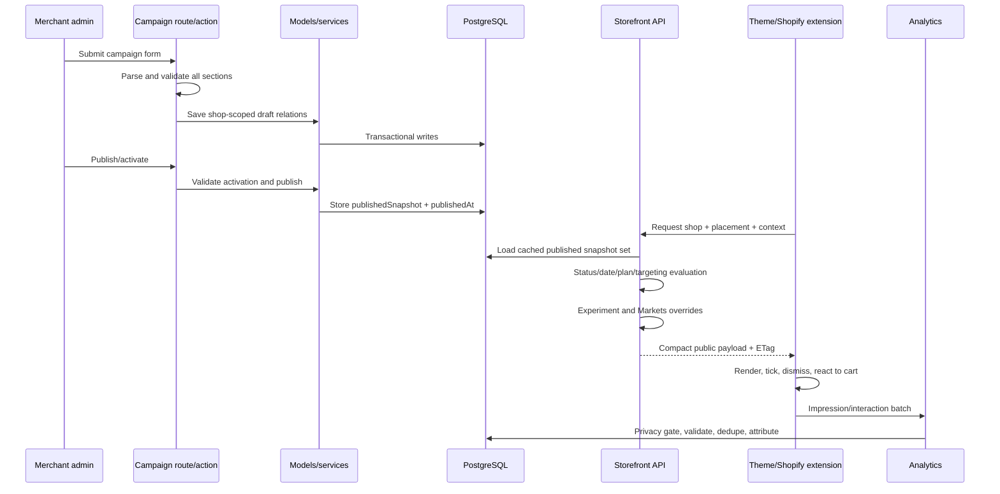

# Campaign data flow

## Evaluation stages

1. Publication: relational state is copied into `publishedSnapshot`. Storefront hydration uses this copy while retaining database identity fields needed by the query.
2. Base activity: `ACTIVE`, schedule, timer expiration behavior, and optional placement filtering are checked in `app/models/campaign.server.ts`.
3. Request context: `parseStorefrontCampaignContext()` reads placement(s), product/collection/tags, country/market/locale, URL/UTM/device, cart, visitor/session, consent, and shop.
4. Access and limits: storefront access, rate limit, monthly impression gate, and plan capability filter run before serialization.
5. Targeting: explicit product/collection/URL exclusions fail first; every configured inclusion dimension must match. Behavior targeting uses a privacy-gated derived profile.
6. Serialization: translation, design, timer, offer, type-specific settings, and placement descriptors become a public view model.
7. Overrides: active experiment assignment and the most specific Markets rule can modify the serialized campaign. Disabled Market rules remove it for that context.
8. Rendering and events: theme/UI extensions render; analytics ingestion validates shop access and privacy, deduplicates sequentially, then records attribution where applicable.

## Cache implications

Published snapshot version, context, active experiment visitor scope, behavior targeting, and upcoming start/end boundaries influence cache eligibility or keys. Adding a context-dependent rule without updating `app/services/storefront-cache.server.ts` can serve the wrong campaign.

## Related documentation

[Storefront rendering](storefront-rendering.md), [placements and targeting](../domain/placements-and-targeting.md), [analytics](../domain/analytics-and-reporting.md).

## Maintenance

Source of truth: `campaign.server.ts`, `storefront-campaigns-response.server.ts`, `storefront-campaigns.ts`, experiment and Markets services. Update when stage order or cache variance changes.
