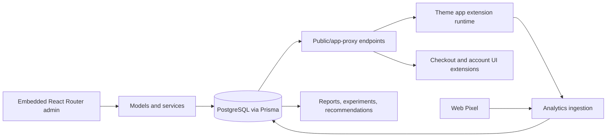

# Architecture overview

Promo Pulse has five runtime boundaries. The embedded admin edits relational campaign state; publishing captures an immutable JSON snapshot. Public API services select and serialize snapshots for storefront context. Static theme assets render most storefront placements. Shopify-hosted UI/Pixel/Function extensions handle surfaces unavailable to ordinary theme JavaScript.

## Boundaries

- `app/routes/` owns HTTP and React Router contracts. Authenticated admin routes must use admin authentication; public endpoints use storefront/app-proxy or extension-specific authentication.
- `app/models/` owns Prisma-backed operations. `app/services/` owns use cases and integrations. Pure calculation and serialization are generally in `app/utils/` or `app/lib/`.
- `app/models/campaign.server.ts` is deliberately both persistence-heavy and central: saves, publishes, duplicates, transitions, and hydrates snapshots all couple here.
- `app/utils/storefront-campaigns.ts` is the eligibility/payload hub. Changes can affect every storefront renderer, experiments, Markets, cache behavior, and tests.
- `theme-extension-src/promo-pulse-theme/` is a browser runtime without imports from the TypeScript server. Timer, dismissal, targeting-context, and render logic are therefore duplicated across assets.
- `extensions/promo-pulse-checkout`, `promo-pulse-order-status`, `promo-pulse-web-pixel`, and `promo-pulse-advanced-discounts` are separately deployed Shopify runtimes with their own target constraints.

## Failure model

Storefront and extension failures degrade to no campaign rather than blocking shopping or checkout. Admin errors should preserve submitted values and return actionable validation. Public routes verify shop/access, rate-limit where applicable, respect plan/privacy gates, and avoid leaking internal records. Cache entries must expire at the next schedule boundary and change with published content/context.

## Entry points

- Route registration: `app/routes.ts`; file routes: `app/routes/`.
- Admin shell: `app/routes/app.tsx`; campaign list/create/edit: `app/routes/app.campaigns*.tsx`.
- Storefront API: `app/routes/api.storefront.campaigns.ts` and app-proxy aliases.
- Theme boot: Liquid blocks in `extensions/promo-pulse-theme/blocks/` and `theme-extension-src/promo-pulse-theme/campaign-loader.js`.
- Shopify configuration: `shopify.app.toml`, `extensions/*/shopify.extension.toml`.

## Related documentation

[Data flow](data-flow.md), [storefront rendering](storefront-rendering.md), [persistence](persistence.md), [Shopify integration](shopify-integration.md).

## Maintenance

Source of truth: the runtime entry points above. Update when a runtime boundary, ownership rule, or cross-runtime dependency changes.
